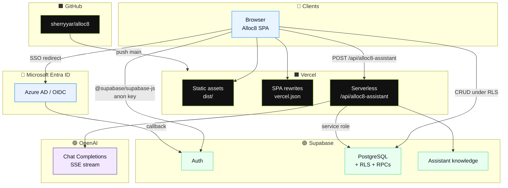
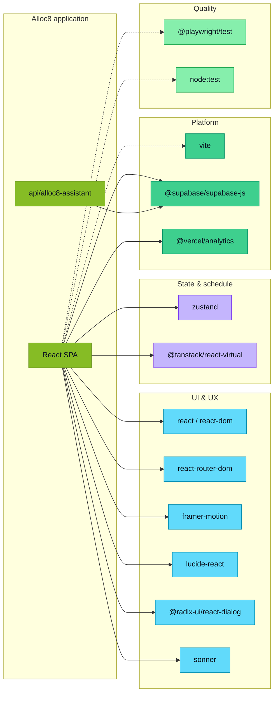
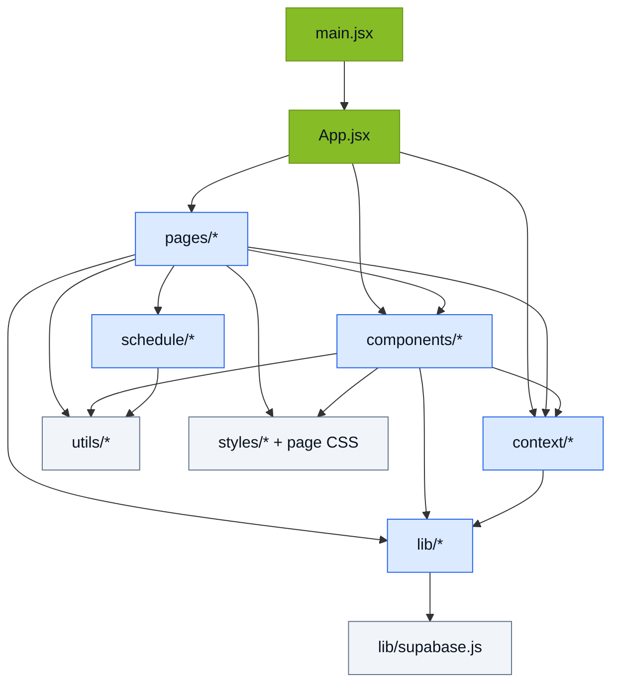
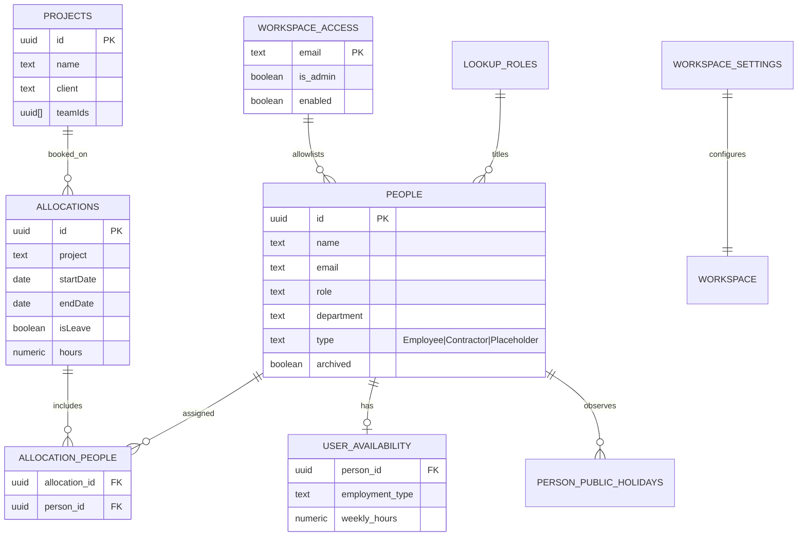
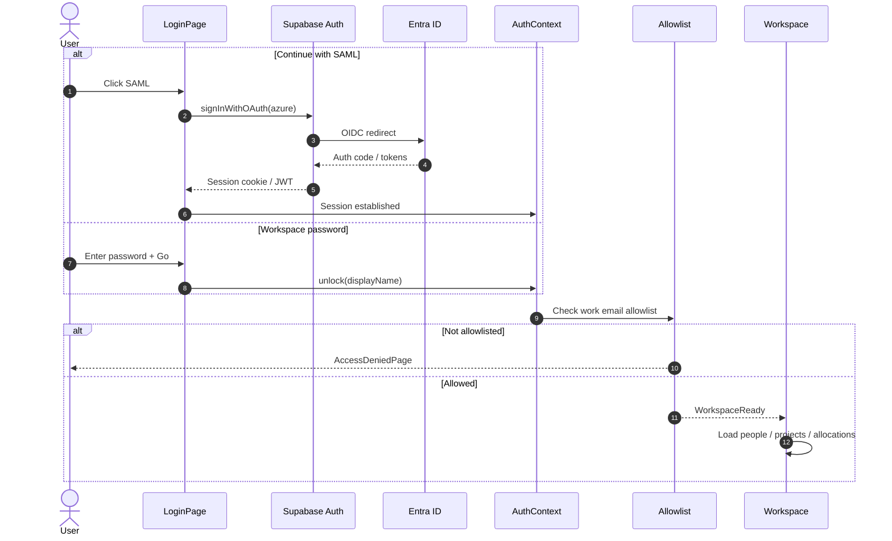
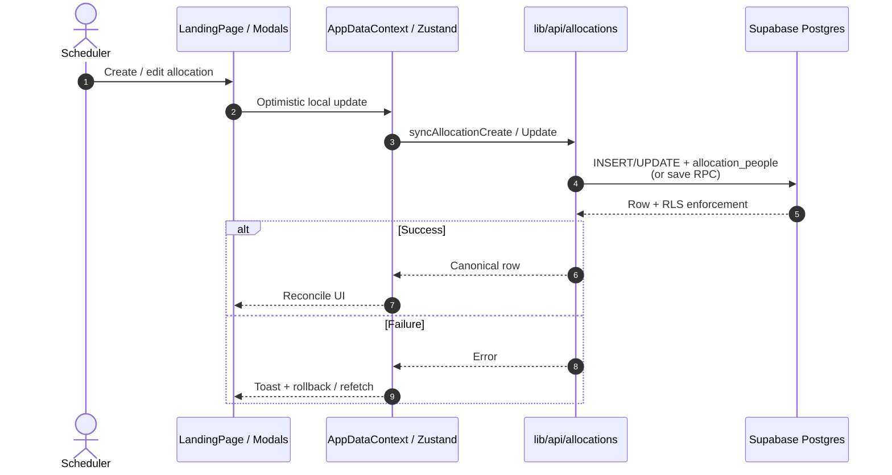
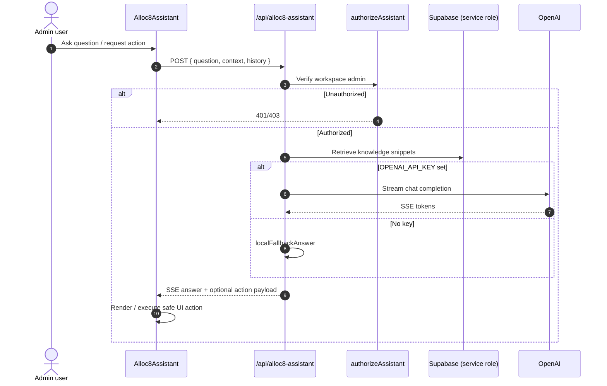
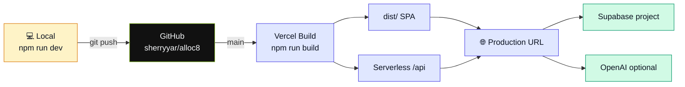

# Alloc8

<p align="center">
  <strong>Agentic workforce scheduling</strong><br/>
  Plan capacity · Allocate people · Run standups · Ask the agent
</p>

<p align="center">
  <a href="#tech-stack"></a>
  <a href="#tech-stack"></a>
  <a href="#tech-stack"></a>
  <a href="#tech-stack"></a>
</p>

<p align="center">
  
  
  
  
  <a href="https://github.com/sherryyar/alloc8"></a>
</p>

---

## Description

**Alloc8** is an internal **resource & capacity planning** product for delivery organizations. It replaces spreadsheet-heavy scheduling with a live timeline, a people/project registry, utilization reporting, standup workflows, and an optional **AI agent** that can explain the product and perform safe UI actions.

It is inspired by Float-class workforce tools, purpose-built for modern enterprise sign-in (Microsoft Entra / SAML-style SSO), Postgres-backed tenancy via Supabase, and Vercel deployment.

| | |
|---|---|
| **Problem** | Delivery leads need one place to see who is free, who is booked, and how to rebalance work — without drowning in filters and exports. |
| **Solution** | A schedule-first SPA with strong filters, placeholders, reporting, and conversational assistance. |
| **Users** | Delivery leads, resource managers, department heads, workspace admins. |
| **Deploy** | GitHub → Vercel; data & auth on Supabase. |

---

## Contents

- [Features](#features)
- [Tech stack](#tech-stack)
- [Diagrams](#diagrams)
  - [System architecture](#1-system-architecture)
  - [Dependency graph](#2-dependency-graph)
  - [Frontend module map](#3-frontend-module-map)
  - [Domain ER diagram](#4-domain-er-diagram)
  - [Auth sequence](#5-auth-sequence)
  - [Schedule write path](#6-schedule-write-path)
  - [AI assistant sequence](#7-ai-assistant-sequence)
  - [CI / CD pipeline](#8-ci--cd-pipeline)
- [Repository layout](#repository-layout)
- [Domain model](#domain-model)
- [Auth & access](#auth--access)
- [Runtime flows](#runtime-flows)
- [AI assistant](#ai-assistant)
- [Getting started](#getting-started)
- [Configuration](#configuration)
- [Scripts](#scripts)
- [Deployment](#deployment)
- [Quality](#quality)
- [Contributing](#contributing)
- [License](#license)

---

## Features

| Area | Capabilities |
|------|----------------|
| **Schedule** | Virtualized people timeline, allocation bars, leave, public holidays, density modes, advanced filters |
| **People** | Directory, roles, departments, Employee / Contractor / **Placeholder** types |
| **Projects** | Registry, teams, rates, project-scoped planning |
| **Insights** | Reporting, department dashboard, capacity / utilization |
| **Standup** | Department order + guided walkthrough on the live schedule |
| **Security** | Work-email allowlist, workspace admin gates, RLS on Postgres |
| **Agent** | Contextual help + safe UI actions (admin-oriented) |
| **Auth** | Entra SSO (primary) + minimal workspace-password fallback |

---

## Tech stack

### At a glance

<p>
  
  
  
  
  
  
  
  
  
  
</p>
<p>
  
  
  
  
  
  
  
</p>

### By layer

| Layer | Technology | Role |
|:-----:|------------|------|
|  | **React 18**, React Router 6, Framer Motion, Lucide, Radix Dialog, Sonner | Interactive SPA, routing, motion, feedback |
|  | **Zustand** + React Context | Workspace store + cross-cutting providers |
|  | **@tanstack/react-virtual** + custom layout engine | Large timelines without DOM blow-ups |
|  | **Vite 5**, `@vitejs/plugin-react` | Dev server, HMR, production bundles |
|  | **Supabase** (Postgres, Auth, RLS, RPCs) | Source of truth for people / projects / allocations |
|  | **Microsoft Entra ID** via Supabase Azure provider | Enterprise SSO (primary entry) |
|  | **Vercel** static + `/api/*` serverless | Hosting, SPA rewrites, assistant API |
|  | **OpenAI** (server-only) + optional RAG docs | Streaming Alloc8 Agent |
|  | **Playwright** + `node --test` | E2E and unit smoke |

### Styling & design tokens

| Token | Value / approach |
|-------|------------------|
| Brand green | `#86bc25` / `#9fd43a` / `#6b961e` (enterprise green theme) |
| Typography | **Syne** (display), **DM Sans** (body), **JetBrains Mono** (meta) |
| CSS strategy | Design-system variables + page-colocated CSS (no Tailwind required) |

---

## Diagrams

GitHub renders the Mermaid graphs below automatically on the repository README.

### 1. System architecture

End-to-end runtime: browser SPA, Vercel edge, Supabase, Entra, OpenAI.



**Trust boundary:** browser only receives `VITE_*` public keys. `OPENAI_API_KEY` and Supabase **service role** stay on the server.

### 2. Dependency graph

Major runtime libraries and what they support.



### 3. Frontend module map

How source folders depend on each other (simplified).



### 4. Domain ER diagram

Core scheduling entities (logical model).



### 5. Auth sequence

Primary SAML/OIDC path vs password fallback.



### 6. Schedule write path

Creating or updating an allocation from the timeline.



### 7. AI assistant sequence



### 8. CI / CD pipeline



---

## Repository layout

```text
alloc8/
├── api/                 # Vercel serverless — Alloc8 Agent
├── docs/                # Product / assistant notes
├── public/              # Static assets
├── scripts/             # SSO, migrations, CSV import, Vite API plugin
├── src/
│   ├── App.jsx          # Providers, auth gate, routes
│   ├── pages/           # Route screens (+ CSS)
│   ├── components/      # UI, modals, assistant, nav
│   ├── context/         # Auth, data, theme, assistant, …
│   ├── schedule/        # Timeline virtualization & geometry
│   ├── lib/             # Supabase client + domain API
│   ├── utils/           # Pure helpers
│   └── styles/          # Design tokens
├── supabase/migrations/ # Ordered SQL schema
├── tests/               # Playwright
├── vercel.json
├── vite.config.js
└── .env.example
```

### Routes

| Path | Module |
|------|--------|
| `/` | Schedule (`LandingPage`) |
| `/people` | People |
| `/projects` | Projects |
| `/departments` | Departments |
| `/standup` | Standup setup |
| `/report` | Reporting |
| `/dept-dashboard` | Department dashboard |
| `/access` | Allowlist (admins) |
| `/settings` | Settings |

---

## Domain model

See the [ER diagram](#4-domain-er-diagram) above. Summary:

| Entity | Purpose |
|--------|---------|
| `people` | Roster; `type` ∈ Employee · Contractor · Placeholder |
| `projects` | Projects + team membership |
| `allocations` / `allocation_people` | Dated work & leave |
| Lookups | Roles, departments |
| `user_availability` | Weekly capacity patterns |
| Public holidays | Region/country calendars per person |
| `workspace_settings` | Workspace prefs |
| `workspace_access` | Email allowlist / admin |
| Assistant knowledge | RAG corpus for the agent |

Client mappers: `src/lib/api/*` (DB snake_case ↔ app camelCase).

---

## Auth & access

See the [auth sequence](#5-auth-sequence). Quick reference:

| Mode | Notes |
|------|--------|
| **SSO** | Intended production path; redirect URLs must include Vercel + localhost |
| **Password** | Local / break-glass; set `VITE_APP_ACCESS_PASSWORD` |
| **Allowlist** | Admins manage `/access`; failed sign-in prompts Slack support |

---

## Runtime flows

1. **Boot** — providers mount → auth gate → load workspace snapshot into Zustand.
2. **Schedule** — filter/sort people → virtualize rows → create/edit allocations via modals → persist through Supabase / RPCs.
3. **Placeholders** — plan work on diamond rows; reassign via drag/swap utilities.
4. **Reporting** — capacity & utilization over ranges (placeholders = zero capacity).
5. **Standup** — department order + walkthrough overlays on the live grid.

---

## AI assistant

| Piece | Location |
|-------|----------|
| UI | `src/components/assistant/*` |
| API | `POST /api/alloc8-assistant` (SSE) |
| Local dev | Vite plugin mirrors the same handler |
| Auth | Workspace-admin oriented |
| Knowledge | `npm run assistant:ingest` → Supabase |
| Fallback | Works without `OPENAI_API_KEY` (limited local answers) |

---

## Getting started

### Prerequisites

- **Node.js** ≥ 20 (LTS)
- **npm** 10+
- Optional: Docker + Supabase CLI, Vercel CLI

### Install

```bash
git clone https://github.com/sherryyar/alloc8.git
cd alloc8
npm install
cp .env.example .env.local
```

Fill at least:

```env
VITE_SUPABASE_URL=https://<project>.supabase.co
VITE_SUPABASE_ANON_KEY=<anon-or-publishable-key>
```

### Develop

```bash
npm run dev
```

Open **http://127.0.0.1:5173/**

### Local database (optional)

```bash
npm run supabase:start
npm run supabase:db:reset
```

Copy URL + anon key from `npm run supabase:status` into `.env.local`.

---

## Configuration

Full annotated list: **[`.env.example`](.env.example)**.

| Variable | Runtime | Purpose |
|----------|---------|---------|
| `VITE_SUPABASE_URL` | Browser | Project URL |
| `VITE_SUPABASE_ANON_KEY` | Browser | Public key (RLS applies) |
| `VITE_APP_ACCESS_PASSWORD` | Browser | Password fallback |
| `VITE_LOGIN_SKIP_AUTH` | Browser | Dev skip-login |
| `VITE_SSO_EMAIL_DOMAIN` | Browser | Entra `domain_hint` |
| `OPENAI_API_KEY` | Server | Agent streaming |
| `SUPABASE_SERVICE_ROLE_KEY` | Server | Privileged assistant / RAG |
| `ASSISTANT_DEV_BYPASS` | Server | Local assistant auth bypass |

> Never commit `.env.local`, service-role keys, or Azure client secrets.

---

## Scripts

| Command | Description |
|---------|-------------|
| `npm run dev` | Vite + local assistant API |
| `npm run build` | Production → `dist/` |
| `npm run preview` | Preview production build |
| `npm run test:e2e` | Playwright |
| `npm run test:agent-crud` | Unit smoke (`node --test`) |
| `npm run supabase:*` | Local / linked DB workflows |
| `npm run sso:configure` | Entra + Supabase helper |
| `npm run migrate:float-csv` | Float people CSV import |
| `npm run assistant:ingest` | Ingest agent knowledge |

---

## Deployment

### GitHub

Repository: **[github.com/sherryyar/alloc8](https://github.com/sherryyar/alloc8)**

```bash
git push -u origin main
```

### Vercel

1. Import `sherryyar/alloc8`.
2. Framework: **Vite** · Build: `npm run build` · Output: `dist`.
3. Set `VITE_*` (client) and server secrets (`OPENAI_*`, service role, …).
4. Production branch: **`main`**.
5. Confirm Auth redirect allowlists include production, previews, and `http://localhost:5173/**`.

`vercel.json` keeps `/api/*` on serverless functions and sends other routes to `index.html` for client-side routing.

---

## Quality

```bash
npm run test:agent-crud
npx playwright install   # once
npm run test:e2e
npm run build            # required before merge
```

---

## Contributing

1. Branch from `main` (`feat/…`, `fix/…`).
2. Match existing API/CSS patterns under `src/`.
3. Prefer ordered SQL migrations for schema changes.
4. Do not commit secrets, dumps, or large CSVs (see `.gitignore`).
5. Open PRs against `main` with a short summary + test notes.

---

## License

**Proprietary** — internal use only unless the repository owner states otherwise.

---

<p align="center">
  <sub>Made with ❤️ by Sheher</sub>
</p>
